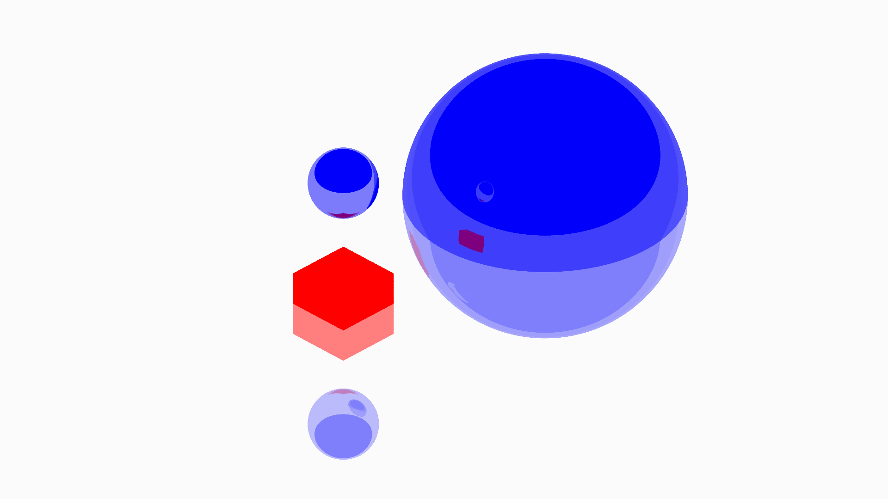

# Isometric-raytracer

## What is it?
A basic raytracer written to learn the language go. It renders the scene with a [video-game style "isometric" projection](https://en.wikipedia.org/wiki/Isometric_graphics_in_video_games_and_pixel_art) (technically a dimetric projection with a 2:1 pixel ratio). That is, rays from the camera are emitted in parallel, and the camera is oriented so that a line parallel to the x or z axes will be rendered with a gradient of ±0.5 pixels/pixel (up one pixel for every two pixels it goes left or right).

## What can it do?
- Render basic shapes such as planes, cubes and spheres.
- Add simple materials to shapes which specify reflectivity and colour.

# TODO:
- Finish composite shapes - this means that a complex shape can be built using binary operations on simpler shapes (known as [constructive solid geometry](https://en.wikipedia.org/wiki/Constructive_solid_geometry)).
- Extend materials to allow for textures and refraction.
- Implement a configuration file format to describe a scene.
- Implement proper parallel rendering.
